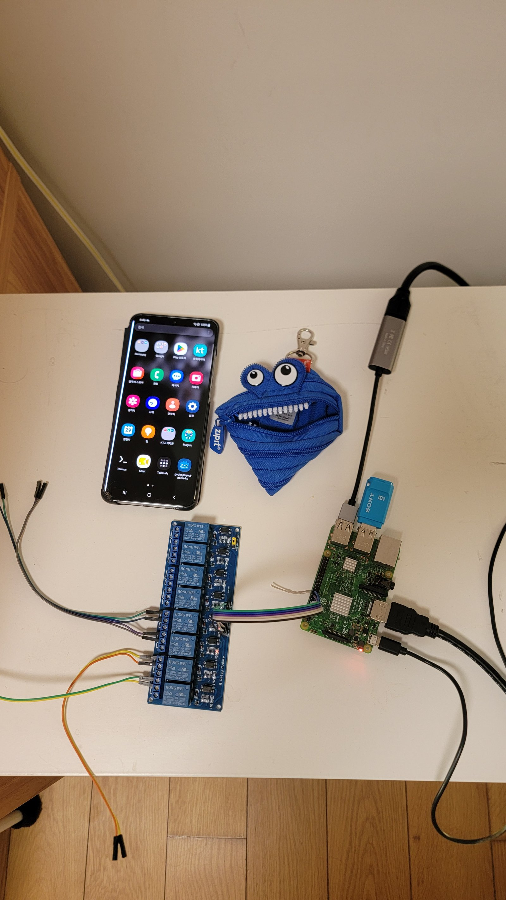

# DIY KVM / IPMI with a rooted Android phone + Raspberry Pi

Turn a **rooted Android phone** into a **USB HID keyboard** for a PC/server (real BIOS/boot-level
input), and use a **Raspberry Pi** as the brain: **HDMI capture (video)**, **relay-based power/reset**,
**web UI**, and **remote access**. Basically a budget replacement for a BMC/IPMI iKVM on consumer
motherboards that have none.


*Live screen + keyboard (click to focus) + per-machine Power / Reset / Force-Off buttons and status.*

```
                 ┌───────────── browser (LAN / Tailscale VPN) ──────────────┐
                 ▼                                                          │
        [ Raspberry Pi ]  ── video(MJPEG) + keyboard(WebSocket) + power/reset(relay) + status
           │      │
   HDMI-USB │      │ WiFi (control daemon :4711)
  capture   │      ▼
           │   [ rooted Android phone ]  ── USB HID keyboard ──► [ target server ]
           │                                   (+ HDMI out ──► capture dongle ──► Pi)
           └── GPIO ──► 8-ch relay ──► motherboard POWER/RESET headers
```

## Features

- **Video** – HDMI-USB capture dongle (UVC/MJPEG) streamed to the browser as MJPEG.
- **Keyboard** – the phone presents itself as a real USB HID boot keyboard to the target
  (works at **BIOS / bootloader / login** level).
- **Power / Reset / Force-off** – 8-channel relay driven by the Pi GPIO (momentary button press;
  force-off = hold power ~10 s).
- **Status** – per-machine ping + phone USB state.
- **Remote** – Tailscale (or LAN). HTTP Basic Auth on the web UI.
- **Auto-recovery** – phone Magisk module re-applies HID at boot + watchdog; Pi runs as a systemd
  service with `Restart=always`.

## Components

| Part | Role |
|------|------|
| Rooted Android phone (kernel with `CONFIG_USB_CONFIGFS_F_HID=y`) | USB HID keyboard to the target |
| Raspberry Pi (any model) | HDMI capture host, web server, relay controller, VPN node |
| HDMI-USB capture dongle (e.g. MacroSilicon MS2109) | video |
| 8-channel relay module (active-LOW, opto) + front-panel extension cable | power/reset |
| (optional) USB Wi-Fi | wireless operation |

## Hardware



*Raspberry Pi + HDMI-USB capture dongle + 8-channel relay module, and the Android phone that acts as the USB HID keyboard.*

## Repository layout

```
pi/                     Raspberry Pi side
  kvm_web.py            web server: MJPEG + WebSocket keyboard + relay + status
  kvm.html              browser UI (video + keyboard + power/reset buttons)
  kvmctl.py             simple CLI controller (type text / press keys) over the network
  mjpeg_server.py       standalone video-only server (no control) — optional
  make_desc.py          generates the USB HID keyboard report descriptor
  deploy/kvm-web.service  systemd unit
android/module/         Magisk module (drops into /data/adb/modules/<id>/)
  module.prop
  service.sh            boot-time setup + watchdog
  s20hid_apply.sh       switch USB gadget to HID keyboard
  hidd.sh               TCP command daemon (/dev/hidg0)
  hidd_launch.sh        listener launcher
  hid_desc_kbd.bin      63-byte boot keyboard report descriptor
```

---

## 1. Android (phone) side

Requirements: **root (Magisk)** and a kernel with **`CONFIG_USB_CONFIGFS_F_HID=y`**
(check `zcat /proc/config.gz | grep F_HID`).

Install the Magisk module:

```bash
# from a PC with adb
adb shell 'su -c "mkdir -p /data/adb/modules/s20_hid"'
adb push android/module/. /data/local/tmp/s20_hid_mod/
adb shell 'su -c "cp /data/local/tmp/s20_hid_mod/* /data/adb/modules/s20_hid/; chmod 755 /data/adb/modules/s20_hid/*.sh"'
adb reboot
```

After boot the phone should present itself to the target as a USB keyboard, keep `adbd` reachable
over TCP (`persist.adb.tcp.port=5555`), and run the control daemon on **:4711**.

> The daemon writes the 8-byte HID report to `/dev/hidg0` with a **single `write()`** (via a temp
> file + `cat`). Writing it byte-by-byte from the shell makes the host see one-byte "modifier"
> reports — the single-write step is essential.

## 2. Raspberry Pi side

```bash
# deps: v4l2-ctl (v4l-utils) and python3 (stdlib only) + lgpio
sudo apt install -y v4l-utils python3-lgpio

# files
mkdir -p ~/kvm && cp pi/kvm_web.py pi/kvm.html pi/kvmctl.py ~/kvm/
cp pi/machines.example.json ~/kvm/machines.json   # edit
cp pi/auth.example.json    ~/kvm/auth.json        # edit (set a real password)

# systemd
sudo cp pi/deploy/kvm-web.service /etc/systemd/system/kvm-web.service
#   -> edit WorkingDirectory / ExecStart paths for your user
sudo systemctl daemon-reload
sudo systemctl enable --now kvm-web
# tell the Pi where the phone's control daemon is (default 192.168.1.50):
echo 'KVM_PHONE=192.168.1.50' | sudo tee /etc/default/kvm-web
sudo systemctl restart kvm-web

# open http://<pi>:8080/  (login with auth.json)
```

`kvm_web.py` reads two files next to it:

- `machines.json` — `{ name: { ip, power, reset } }` (`ip` may be `null`; `power`/`reset` are
  **BCM GPIO numbers**)
- `auth.json` — `{ "user": "...", "password": "..." }` (empty/absent password disables auth)

## 3. Relay wiring

Relay module `IN1..IN8` → Pi GPIO (BCM). By default:

| machine | power | reset |
|---------|-------|-------|
| b550 | GPIO14 | GPIO15 |
| 3090 | GPIO23 | GPIO24 |

Wire each relay **COM/NO** across the target's front-panel `PWR_SW` / `RESET_SW` pins
(momentary, no polarity). **Never connect Pi GPIO directly to the motherboard** — use the relay
contacts (isolated). Power the relay module from the Pi 5V/GND (a good 5V/2.5A+ supply).

GPIO is driven **open-drain** (`0` = relay ON, `Hi-Z` = OFF), which is what cheap 5 V active-LOW
relay boards need.

---

## Usage

- Open `http://<pi>:8080/` → live screen + click it, then type.
- Toolbar: **Fullscreen**, **Ctrl+Alt+Del**, **Win+R**, **Release**.
- Per-machine buttons: **Power** (0.5 s), **Reset** (0.5 s), **ForceOff** (holds power 10 s).

CLI (from any host that can reach the phone's daemon):

```bash
python3 pi/kvmctl.py type "echo hello"
python3 pi/kvmctl.py key enter
python3 pi/kvmctl.py combo ctrl alt delete
```

## Security

The web UI is protected by **HTTP Basic Auth** (`auth.json`). Put the Pi behind a **WireGuard /
Tailscale** network and prefer that over exposing port 8080. Change the password and don't commit
`auth.json` / `machines.json` (see `.gitignore`).

## Known gotchas (learned the hard way)

1. **`printf` byte-by-byte writes break HID** — always write the whole report in one `write()`.
2. **One USB device = one host.** A phone-as-keyboard can only drive one machine at a time; for N
   machines use N HID devices (phone/Pico) or a USB KVM switch. USB hubs are for host→devices, not
   device→multiple hosts.
3. **Same-subnet dual-homing** (eth0 + wlan0) breaks connections to the Wi-Fi IP — unplug Ethernet
   or fix routing.
4. **Force-off = hold the power button** (~4–10 s). Map it to the *power* relay pin.
5. `nc -L -p 4711` may bind **IPv6**; check `/proc/net/tcp6` too.
6. A virtual HID over the network (USB/IP) only works inside a running OS — it **cannot** replace a
   physical HID for BIOS/boot recovery.

## 한국어 요약

- **구성**: 루팅된 안드로이드 폰 = 서버에 USB 키보드(HID), 라즈베리파이 = 영상(HDMI캡처)·전원/리셋(릴레이)·웹UI·원격.
- **서버에 IPMI/BMC가 없는 소비자 보드**에서 BIOS/부팅 단계까지 원격 제어 → 사실상 DIY PiKVM.
- 폰: Magisk 모듈로 부팅 시 자동 HID + `:4711` 데몬. (커널에 `F_HID` 필요)
- 파이: `kvm_web.py`(영상+키보드+릴레이+상태) + systemd. `machines.json`(대상/핀), `auth.json`(암호) 설정.
- 릴레이: `IN1..IN8 → GPIO`, `COM/NO → 전면패널 PWR_SW/RESET_SW` (절연). open-drain.
- 보안: Basic Auth + Tailscale 권장.
- **핵심 함정**: HID 리포트는 반드시 **한 번의 write**로(셸 printf는 1바이트씩 써서 깨짐).

## License

MIT
